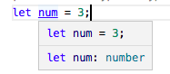

# Type assignments and Type Inference

## Type Inference

In some situations when a type is not assigned to a variable , typescript uses type inference to provide information about what type of value a variable can hold.



The type of the `num` variable is inferred to be number. This kind of inference takes place when initializing variables and members, setting parameter default values, and determining function return types.

## Type Assignments

Type assignments are only a typescript feature, will not be a part of javascript.<br>

```
function add(a: number, b: number) {
    return a+b;
}
```

In the `add` function, the type assignments for the two parameters `a` and `b` are set to `number`. So this function accepts only values which are only numbers. <br>
when the typescript code is compiled to javascript, these type assignments for the parameters will be missing as they are a typescript feature.
